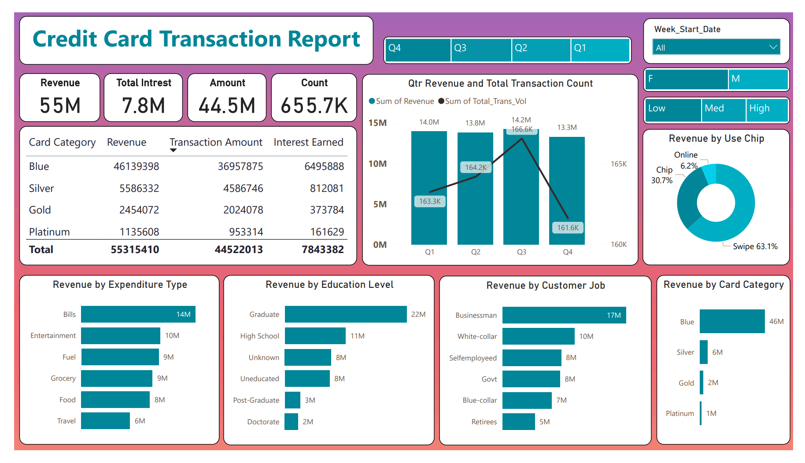
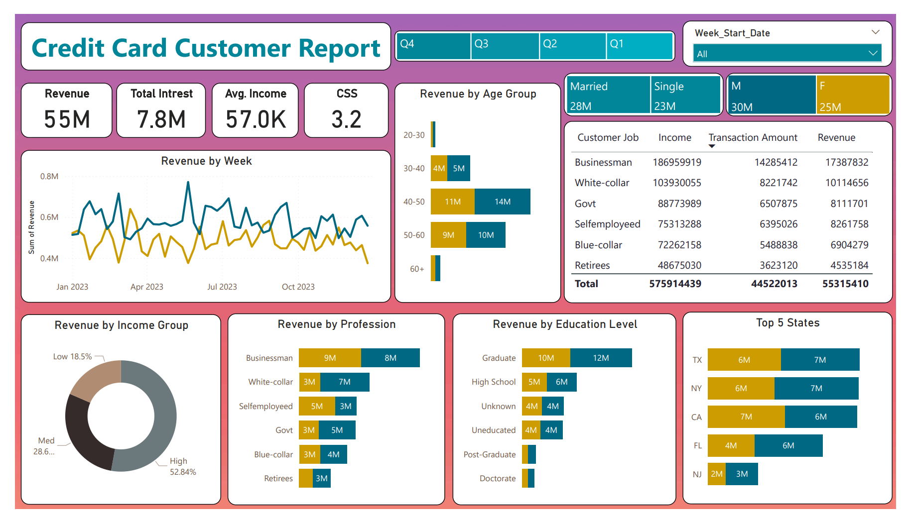

# Credit Card Transaction and Customer Analysis
This project involves the analysis of credit card transactions and customer details to generate insights and reports using Power BI. The dataset consists of two tables: Credit Card and Customer Details. The report provides various metrics such as revenue by expenditure type, education level, customer job, card category, transaction method, income group, age group, profession, marital status, and state.

## Tech Stack
- SQL Server
- PowerBI Desktop
- PowerBI Service

## Datasets

### Credit Card Data
#### Columns: 
Client_Num, Card_Category, Annual_Fees, Activation_30_Days, Customer_Acq_Cost, Week_Start_Date, Week_Num,Qtr, current_year, Credit_Limit, Total_Revolving_Bal, Total_Trans_Amt, Total_Trans_Vol, Avg_Utilization_Ratio, Use Chip, Exp Type, Interest_Earned, Delinquent_Acc

### Customers Data
#### Columns: 
Client_Num, Customer_Age, Gender, Dependent_Count, Education_Level, Marital_Status, state_cd, Zipcode,Car_Owner, House_Owner, Personal_loan, contact,Customer_Job, Income, Cust_Satisfaction_Score

## DAX Concept Used
- SWITCH: Used to create categorical variables based on conditions.
- IF: Used to create new columns or measures based on conditions.
- FILTER: Used to filter data based on certain criteria.
- SUM: Used to calculate the sum of a column.
- SUMX: Used to calculate the sum of an expression evaluated for each row of a table.
- AVERAGE: Used to calculate the average of a column.
- AVERAGEX: Used to calculate the average of an expression evaluated for each row of a table.
- WEEKNUM: Used to calculate the week number for date-related calculations.

## Screenshots

Credit Card Transaction Report

Credit Card Customer Report

## Analysis and Report
The report includes insights on:

- Quarterly Revenue and Transaction Volume
- Revenue by Expenditure Type
- Revenue by Education Level
- Revenue by Customer Job
- Revenue by Card Category
- Revenue by Transaction Method
- Revenue by Income Group
- Revenue by Age Group
- Revenue by Profession
- Revenue by Marital Status
- Top 5 States by Revenue
- Additional Summary Metrics :
    * Total Revenue
    * Total Interest Earned
    * Total Transaction Amount
    * Total Transaction Count
    * Average Income
    * Customer Satisfaction Score

## Insights
- Blue Card and Silver Card contributes to 93% of Revenue.
- Businessman and White coller persons are most likely to spend using credit card.
- Most of the card holders are Graduated individuals.
- Revenue is higher from Female customers.
- Average income of customers are around ₹ 57000.
- Married individuals spend more compared to bachlors.
- Top 5 States contribuetes to 97% of Revenue.

## Recommendations
- Include offers for Blue Card owners so that they will spend more.
- Offers for Businessman for using credit card for business uses.
- Reduce annual fee for customers having Low income.
- Target graduated individuals for advertising.
- Advertise more in states other than Top 5 States.

## Publish Report
* Power BI Service

    The final report has been published to Power BI Service, allowing for easy sharing and collaboration with stakeholders. This enables real-time access to the report and the ability to interact with the data through various filters and visualizations.